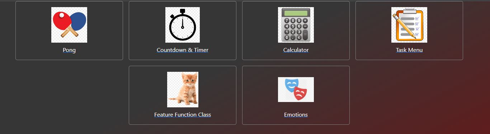

# ABA Apps
  
  
  
  
   

## Table of Contents (Optional)

- [Portfolio](#Portfolio)
- [Description](#Description)
- [Hosting](#Hosting)
- [Screenshot](#Screenshot)
- [Installation](#Installing)
- [Team](#Team)
- [License](#License)
# Portfolio

This project was bootstrapped with [Create React App](https://github.com/facebook/create-react-app).


Hosted Application: insert installed app URL here

## Description

As a parent or caregiver of a child with autism or other developmental disabilities, I want an ABA app that has all the tools and interaction programs that I need all in one dashboard, so that I don't have to have multiple applications open which will allow me more 1:1 time with the child.


## Hosting
Netlify hosting: insert installed app URL here


## Screenshot




## Installing & Setup

If you're looking at hosting this locally, you'll need to install NodeJS.

```shell
$ npm install
$ npm start
```
# Team

- Team Members:
  - John Nelson - https://github.com/fjnelson
  - Brian Nelson - https://github.com/nelsonsbrian
## License

Please refer to the LICENSE in the repo.

